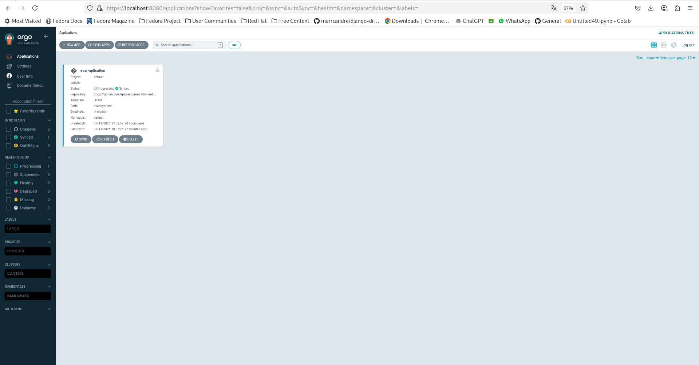

# Trabalho Final – Fundamentos de DevOps

**Aluno:** Gabriel Gomes Galikosky
**Turma:** BSI5
---

## 1. Introdução

Este projeto tem como objetivo desenvolver uma aplicação full stack para correção automatizada de dados de hodômetro de veículos, utilizando técnicas de Machine Learning, banco de dados PostgreSQL, backend em FastAPI e frontend em Vue 3. O projeto também inclui a infraestrutura como código e orquestração do ambiente com Kubernetes, deploy automatizado via GitOps usando ArgoCD, e provisionamento com Ansible.

As principais tecnologias utilizadas foram:
- Python (FastAPI, Pandas, scikit-learn)
- Vue 3 (frontend)
- PostgreSQL (banco de dados)
- Docker e Docker Compose para containerização local
- Kubernetes (kind) para orquestração de containers
- ArgoCD para deploy GitOps
- Ansible para provisionamento do ambiente

---

## 2. Escolha do Ambiente

### Tipo de ambiente utilizado

- Kubernetes local utilizando kind para simular um cluster.
- Containerização dos serviços com Docker.
- Provisionamento automatizado com Ansible.
- Deploy e sincronização automatizada com ArgoCD.

### Justificativa

A escolha do Kubernetes com kind permite testar e validar a infraestrutura e deploy em ambiente de cluster real, porém local, facilitando desenvolvimento e testes sem custos de nuvem. O uso de Docker garante isolamento e portabilidade dos serviços. ArgoCD foi escolhido para demonstrar práticas de GitOps, com deploy automático a partir do repositório Git.

### Descrição das máquinas/instâncias

O ambiente foi provisionado em máquina local Fedora 40, com os serviços containerizados e orquestrados em cluster Kubernetes local (kind). Foram criados os seguintes pods:

- Backend FastAPI
- Frontend Vue 3
- Banco de dados PostgreSQL

---

## 3. Provisionamento

### Ferramentas utilizadas

- Ansible para instalação e configuração do cluster kind, Docker, Kubernetes e ArgoCD.
- Scripts Ansible para instalação das dependências e deploy inicial.

### Scripts criados

- Playbooks Ansible para instalação do Docker, kind, ArgoCD e configuração do ambiente.
- Manifests Kubernetes em YAML para deploy dos serviços.
- Dockerfiles para backend e frontend.

### Desafios e soluções

- Ajustes de rede para permitir acesso aos serviços via port-forward.
- Configuração correta dos manifests para comunicação entre backend, frontend e banco.
- Solução de conflitos de portas em ambiente local.

---

## 4. Cluster Kubernetes

### Ferramenta usada para instalar o cluster

- Kind (Kubernetes in Docker), que permite rodar um cluster Kubernetes local dentro de containers Docker.

### Configuração dos nós

- Cluster simples com um nó único, suficiente para desenvolvimento.
- Todos os serviços rodando como deployments dentro do namespace `machine-learning-ecar`.

### Testes de funcionamento

- Comandos `kubectl get pods` e `kubectl get svc` confirmaram pods em estado `Running`.
- Port-forward configurado para acesso local aos serviços.
- Deploy automático via ArgoCD sincronizando o estado do cluster com o repositório Git.

---

## 5. GitOps com ArgoCD

### Instalação do ArgoCD

- ArgoCD instalado via manifest oficial.
- Configurado para monitorar o repositório Git contendo os manifests do Kubernetes.

### Configuração do repositório Git

- O repositório contém pastas base e overlays para o Kustomize.
- Configuração para deploy do backend, frontend e banco.

### Deploy da aplicação

- ArgoCD sincroniza automaticamente e mantém o estado desejado.
- Tela web do ArgoCD disponível na porta 8080 após port-forward.

### Screenshots do ArgoCD funcionando

---

## 6. Aplicação

### Descrição da aplicação

- Backend desenvolvido em FastAPI, responsável por receber planilhas .xlsx, processar os dados, aplicar modelo de Machine Learning para correção dos valores de hodômetro, armazenar no banco e retornar os dados corrigidos via API REST.
- Banco PostgreSQL para armazenamento dos dados históricos e novos.
- Frontend em Vue 3 que consome a API, permite upload das planilhas e exibe os dados corrigidos.
- Uso das bibliotecas Python: Pandas, NumPy, scikit-learn, SQLAlchemy, psycopg2, joblib, entre outras.

### Como acessar a aplicação no cluster

Para verificar a persistência dos dados e testar as queries durante o desenvolvimento, foi utilizado o DBeaver, uma ferramenta gráfica para acesso e manipulação de bancos de dados. Com o DBeaver, foi possível visualizar as tabelas, executar comandos SQL e validar a estrutura do banco PostgreSQL exposto via port-forward (porta 5432).

Como acessar a aplicação no cluster

    Backend: exposto na porta 8000 via port-forward, acessível em http://localhost:8000/docs.

    Frontend: exposto na porta 3000 via port-forward, acessível em http://localhost:3000.

    Banco de dados PostgreSQL: exposto na porta 5432 via port-forward, utilizado localmente com o DBeaver para visualização dos dados.

Exemplo de acesso:

    Frontend: http://localhost:3000

    Backend (Swagger Docs): http://localhost:8000/docs

---

## 7. Conclusão

### Lições aprendidas

- Experiência prática com provisionamento automatizado usando Ansible.
- Compreensão aprofundada do funcionamento de clusters Kubernetes locais com kind.
- Aplicação de práticas GitOps reais utilizando ArgoCD para deploy automático.
- Desenvolvimento de aplicação full stack com integração entre backend, frontend e banco.
- Aprendizado sobre como versionar, automatizar e orquestrar ambientes complexos.

### Dificuldades encontradas

- Configuração de rede e portas para comunicação entre serviços no cluster.
- Resolução de erros de portas em uso no ambiente local.
- Ajustes finos na estrutura dos manifests e Dockerfiles para compatibilidade.
- Manter a consistência do banco de dados durante deploys.

### O que faria diferente

- Utilizaria um ambiente Kubernetes em nuvem para testes em produção.
- Automatizaria mais ainda a pipeline CI/CD, com testes automatizados integrados.
- Adotaria Helm para gerenciar os charts Kubernetes.
- Melhoraria a interface do frontend para melhor usabilidade.

---

## 8. Link para Repositório

[https://github.com/gomesgalikosky/machine-learning_ecar](https://github.com/gomesgalikosky/machine-learning_ecar)

---

## Bibliotecas e Tecnologias Utilizadas

- **FastAPI:** Framework web para backend rápido e moderno em Python.
- **Pandas e NumPy:** Manipulação e análise de dados.
- **scikit-learn:** Modelos de Machine Learning para correção de dados.
- **SQLAlchemy e psycopg2:** Integração com PostgreSQL.
- **joblib:** Serialização e desserialização de modelos.
- **Unidecode:** Tratamento de strings e normalização de texto.
- **Docker:** Containerização dos serviços.
- **Kubernetes/Kind:** Orquestração de containers.
- **ArgoCD:** Deploy GitOps e sincronização contínua.
- **Ansible:** Automação do provisionamento.

---
